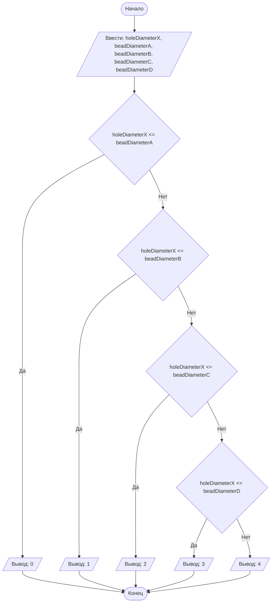

## Отчет по лабораторной работе № 1

#### № группы: `ПМ-2602`

#### Выполнила: `Митрофанова Дарья Владиславовна`

#### Вариант: `13`

### Cодержание:

- [Постановка задачи](#1-постановка-задачи)
- [Входные и выходные данные](#2-входные-и-выходные-данные)
- [Выбор структуры данных](#3-выбор-структуры-данных)
- [Алгоритм](#4-алгоритм)
- [Программа](#5-программа)
- [Анализ правильности решения](#6-анализ-правильности-решения)

### 1. Постановка задачи

- Условия задачи

> Набор бусинок диаметрами A, B, C, D, надетый на нить, пытаются протащить в указанном порядке через отверстие диаметром X. Какое количество бусинок удастся протащить через отверстие? На вход программы подаются натуральные числа X, A, B, C, D.

- Для решения данной задачи нужно написать программу, которая на выводе предоставит информацию о том, сколько из четырёх бусин способно пройти через отверстие.
- Бусина проходит через отверстие тогда и только тогда, когда она строго меньше отверстия. Если же она больше или равна диаметру отверстия - проход осуществить невозможно.
- Так как все бусины связаны и заданы в определённом порядке, при непрохождении, например, бусины А, остальные пройти не смогут в независимости от того, какого они диаметра. Соответственно, для решения задачи мы должны перебрать бусины в строго указанном порядке и, если бусина индекса n не проходит, зафиксировать счётчик на n-1.  

### 2. Входные и выходные данные

#### Данные на вход

На вход программа должна получать 5 чисел, при этом в условии сказано, что они принадлежат множеству натуральных чисел. Нижняя и верхняя граница чисел по условию не заданы, однако, с учётом выбора типа данных, максимальное значение будет ограничено 2<sup>63</sup> - 1.

|             | Тип               | min значение  | max значение           |
|-------------|-------------------|---------------|------------------------|
| X (Число 1) | Натуральное число | 1             | 2<sup>63</sup> - 1     |
| A (Число 2) | Натуральное число | 1             | 2<sup>63</sup> - 1     |
| B (Число 3) | Натуральное число | 1             | 2<sup>63</sup> - 1     |
| C (Число 4) | Натуральное число | 1             | 2<sup>63</sup> - 1     |
| D (Число 5) | Натуральное число | 1             | 2<sup>63</sup> - 1     |

#### Данные на выход

Т.к. программа должна вывести количество бусин, прошедших через отверстие, то на выход мы получим
единственное целое неотрицательное число, не превышающее 4, т.к. на вход подаются диаметры четырёх бусин, следовательно, количество прошедших через отверстие не может превышать 4.

|         | Тип                                | min значение | max значение   |
|---------|------------------------------------|--------------|----------------|
| Число 1 | Целое неотрицательное число        | 0            | 4              |


### 3. Выбор структуры данных

Программа получает 5 целых чисел. Поэтому для их хранения
можно выделить 5 переменных (`holeDiameterX`, `beadDiameterA`, `beadDiameterB`, `beadDiameterC`, `beadDiameterD`) типа `long` для возможности захватить наибольший диапазон значений.

|             | название переменной             | Тип (в Java) | 
|-------------|---------------------------------|--------------|
| X (Число 1) | `holeDiameterX`                 | `long`        |
| A (Число 2) | `beadDiameterA`                 | `long`        |
| B (Число 2) | `beadDiameterB`                 | `long`        |
| C (Число 2) | `beadDiameterC`                 | `long`        |
| D (Число 2) | `beadDiameterD`                 | `long`        |

Для вывода результата необязательно его хранить в отдельной переменной.

### 4. Алгоритм

#### Алгоритм выполнения программы:

1. **Ввод данных:**  
   Программа считывает пять целых чисел, обозначенных как `holeDiameterX`, `beadDiameterA`, `beadDiameterB`, `beadDiameterC`, `beadDiameterD`.

2. **Сравнение чисел:**  
  - Программа сравнивает значения `holeDiameterX` и `beadDiameterA`. Если `holeDiameterX` меньше или равно `beadDiameterA`, программа выводит значение 0. Если `holeDiameterX` больше, программа переходит к следующему сравнению `holeDiameterX` и `beadDiameterB`.
  - Если `holeDiameterX` меньше или равно `beadDiameterB`, программа выводит значение 1. Если `holeDiameterX` больше, программа переходит к следующему сравнению `holeDiameterX` и `beadDiameterC`.
  - Если `holeDiameterX` меньше или равно `beadDiameterC`, программа выводит значение 2. Если `holeDiameterX` больше, программа переходит к следующему сравнению `holeDiameterX` и `beadDiameterD`.
  - Если `holeDiameterX` меньше или равно `beadDiameterD`, программа выводит значение 3. Если `holeDiameterX` больше, программа выводит значение 4.

3. **Вывод результата:**  
   На экран выводится значение от 0 до 4 в зависимости от количества прошедших через отверстие бусин.

#### Блок-схема



### 5. Программа

```java
import java.io.PrintStream;
import java.util.Scanner;

public class Main {
    // Объявляем объект класса Scanner для ввода данных
    public static Scanner sc = new Scanner(System.in);
    // Объявляем объект класса PrintStream для вывода данных
    public static PrintStream out = System.out;
    public static void main(String[] args) {
        // Считывание пяти целых неотрицательных чисел holeDiameterX, beadDiameterA, beadDiameterB, beadDiameterC, beadDiameterD из консоли
        long holeDiameterX = sc.nextLong();
        long beadDiameterA = sc.nextLong();
        long beadDiameterB = sc.nextLong();
        long beadDiameterC = sc.nextLong();
        long beadDiameterD = sc.nextLong();
        // Сравнение диаметра отверстия и бусины A
        if (holeDiameterX <= beadDiameterA) {
            // Бусина A не прошла, остальные не рассматриваем. Выводим 0
            out.print(0);
        } else {
            // Бусина А прошла, сравниваем диаметры отверстия и бусины B
            if (holeDiameterX <= beadDiameterB) {
                // Бусина B не прошла, но до неё прошла бусина A - выводим 1
                out.print(1);
            } else {
                // Бусины А и B прошли, сравниваем диаметры отверстия и бусины C. Далее аналогично
                if (holeDiameterX <= beadDiameterC) {
                    out.print(2);
                } else {
                    if (holeDiameterX <= beadDiameterD) {
                        out.print(3);
                        // Все бусины прошли (ни одна по диаметру не была равна или больше отверстия), выводим 4
                    } else {
                        out.print(4);
                    }
                }
            }
        }
    }
}

```

### 6. Анализ правильности решения

Программа работает корректно на всем допустимом диапазоне значений.

1. Тест на `holeDiameterX <= beadDiameterA`:

    - **Input**:
        ```
        5 5 4 3 2
        ```

    - **Output**:
        ```
        0
        ```

2. Тест на `holeDiameterX <= beadDiameterB`:

    - **Input**:
        ```
        5 1 6 4 3
        ```

    - **Output**:
        ```
        1
        ```

3. Тест на `holeDiameterX <= beadDiameterC`:

    - **Input**:
        ```
        5 2 2 5 1
        ```

    - **Output**:
        ```
        2
        ```

4. Тест на `holeDiameterX <= beadDiameterD`:

    - **Input**:
        ```
        5 2 3 4 5
        ```

    - **Output**:
        ```
        3
        ```
5. Тест на `holeDiameterX <= beadDiameterA` и `holeDiameterX <= beadDiameterB` и `holeDiameterX <= beadDiameterC` и `holeDiameterX <= beadDiameterD`

   - **Input**:
        ```
        5 1 2 3 4
        ```

    - **Output**:
        ```
        4
        ```
